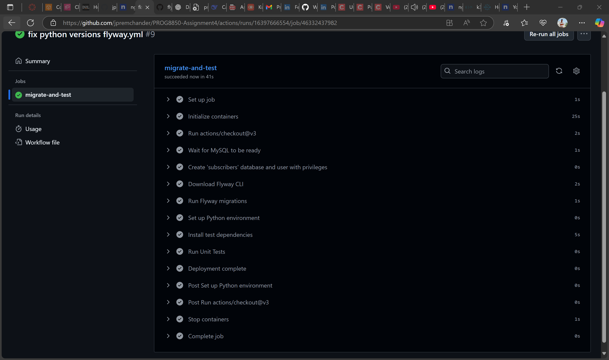
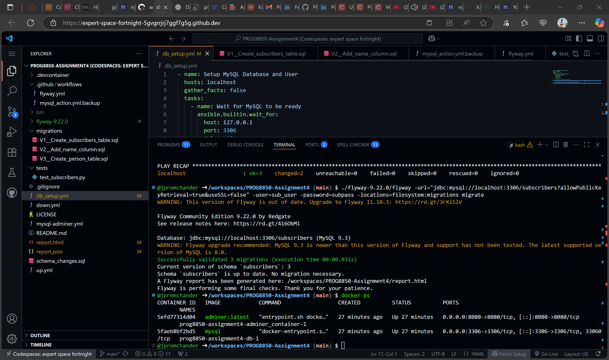
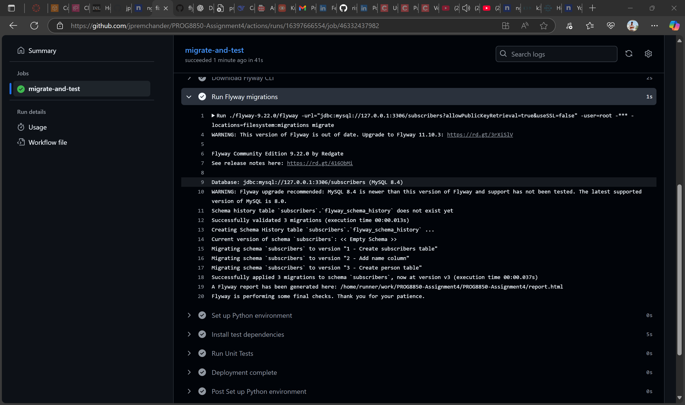
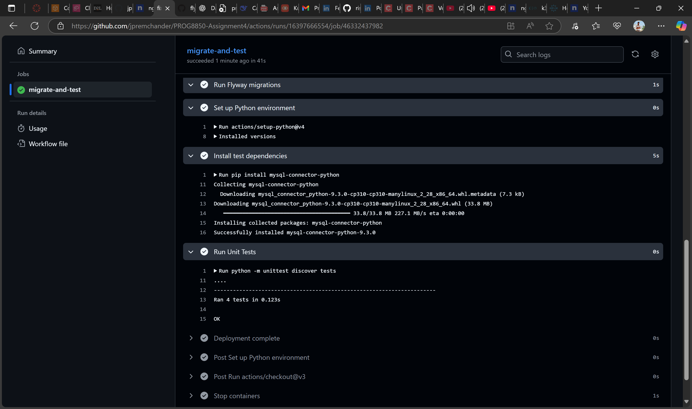

PROG8850 Assignment 4: Database Automation with Flyway and CI/CD

This repository demonstrates a complete database migration and testing automation setup using Flyway, Ansible, MySQL, and GitHub Actions. The goal is to automate schema migrations and verify database functionality through unit tests.

📁 Folder Structure

├── .github
│   └── workflows
│       └── flyway_ci.yml           # GitHub Actions workflow file
├── flyway-9.22.0/                  # Flyway CLI extracted
├── migrations/                     # Initial migration files
│   ├── V1__Create_subscribers_table.sql
│   ├── V2__Insert_seed_data.sql
│   └── V3__Create_person_table.sql
├── tests/
│   └── test_subscribers.py         # Python unit tests for DB operations
├── db_setup.yml                    # Ansible playbook to set up DB and user
└── README.md

✅ GitHub Actions CI/CD Pipeline

Workflow Summary

The GitHub Actions workflow performs the following:

Spins up a MySQL service

Waits for MySQL readiness

Creates the subscribers database and a non-root user (sub_user)

Applies Flyway migrations

Sets up Python and installs test dependencies

Runs unit tests for DB validation

✅ Successful CI/CD Run Screenshot

🐳 Docker Setup (Local)

You can verify that the MySQL container is running with the following:

docker ps

⚙️ Flyway Migration CLI

We used Flyway 9.22.0 for schema versioning and applied SQL migrations:

./flyway-9.22.0/flyway -url="jdbc:mysql://127.0.0.1:3306/subscribers" \
-user=sub_user -password=subpass \
-locations=filesystem:migrations migrate

🧪 Python Unit Tests

Tested basic DB operations using Python's unittest module and mysql-connector-python:

Create subscriber

Read subscriber

Update subscriber

Delete subscriber

📌 How to Run Locally

# ansible-playbook up.yml

# ansible-playbook db_setup.yml

# ./flyway-9.22.0/flyway -url="jdbc:mysql://localhost:3306/subscribers" -user=sub_user -password=subpass -locations=filesystem:migrations migrate

# python3 -m unittest discover tests

🧩 Issues & Troubleshooting

❌ Issue 1: "Unknown Database 'subscribers'"

Cause: Flyway was trying to migrate before the database was created.

Fix: Added a step in the GitHub workflow to create the database using the mysql CLI before Flyway runs.

❌ Issue 2: "Access denied for user 'sub_user'@'172.18.0.1'"

Cause: The user sub_user lacked permissions or was not created in the CI environment.

Fix: Added SQL commands in the workflow to create the user with necessary privileges:

CREATE USER IF NOT EXISTS 'sub_user'@'%' IDENTIFIED BY 'subpass';
GRANT ALL PRIVILEGES ON subscribers.* TO 'sub_user'@'%';
FLUSH PRIVILEGES;

👨‍💻 Author

Student: jpremchander

Course: PROG8850 - Database Administration and Automation -Assignment 4

